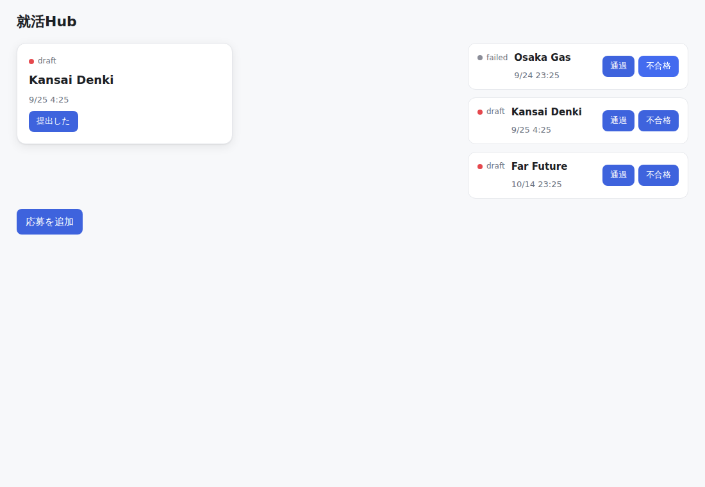
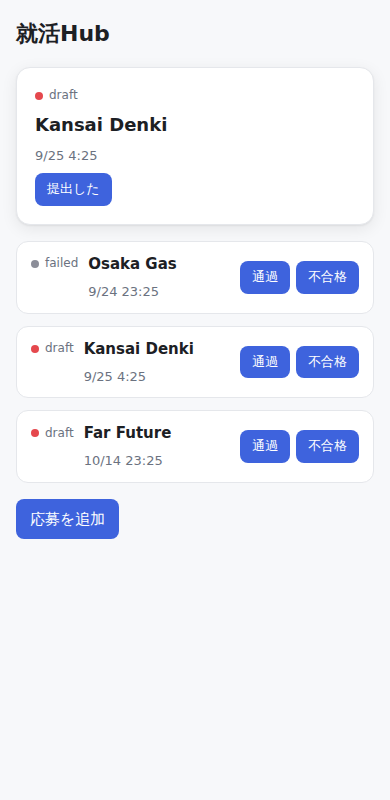

# nameless-lang（仮）— 人とAIの間の言語

「人は決めて、AIが書いて、言語が守る」言語。名前はまだ無い。

- 仕様: `docs/言語仕様_v0.2.md`（最新）、`docs/言語仕様_v0.1.txt`
- 相談の記録: `DESIGN_v0.2.md`（決まったこと）、`DESIGN_ALL.md`（全体案）

## 使い方（v0.2）

```
python -m lang check spec/hub.lang                # 決めてないことを探す
python -m lang check spec/hub_ready.lang --publish  # 公開する時の検査
python -m lang check spec/hub_ready.lang --save-shape  # 通ったら thing の形を残す（次から change を検査）
python -m lang test spec/hub_app.lang             # rule の example を全部流す
python -m lang run  spec/hub_app.lang             # 動かす → http://127.0.0.1:8000/
python -m pytest                                  # テスト
```

## ファイル

| ファイル | 中身 |
|---|---|
| `lang/` | v0.2 のパーサー、チェッカー（エラー27個）、実行エンジン、画面 |
| `spec/hub_app.lang` | ブラウザで動く就活Hub（画面の部品と「追加」を足した版） |
| `spec/hub.lang` | 仕様書 v0.2 付録の就活Hub。tbd が残っているので止まる |
| `spec/hub_ready.lang` | tbd を外した渡せる版 |
| `tests/cases/` | エラーごとの壊した／直した仕様のペア |
| `QUESTIONS_v0.2.md` | 仕様に無くて仮で決めた判定 |
| `lang_v01/`, `tests/v01/`, `spec/*.spec` | v0.1 の実装（Go 変換を含む）。記録として残している |
| `experiment/` | 自然文 vs 言語の比較実験（v0.1 時点。作り直し予定） |
| `NAMES.md` | 名前の候補 |

## 動いている画面

`python -m lang run spec/hub_app.lang` で動かしたもの。依存は Python の標準機能だけ。

| PC | スマホ |
|---|---|
|  |  |
