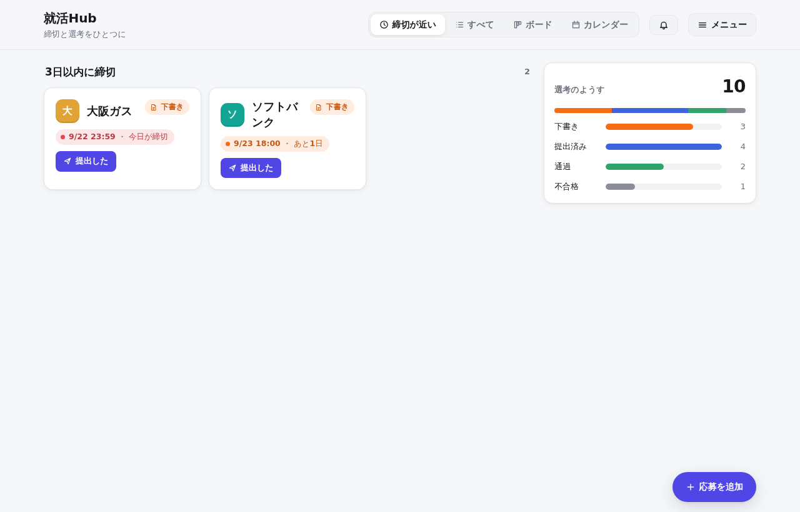
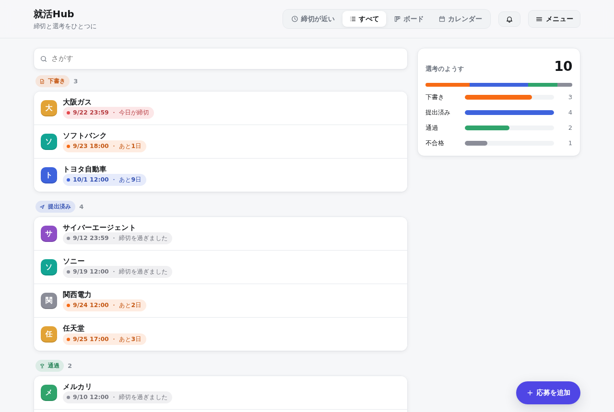
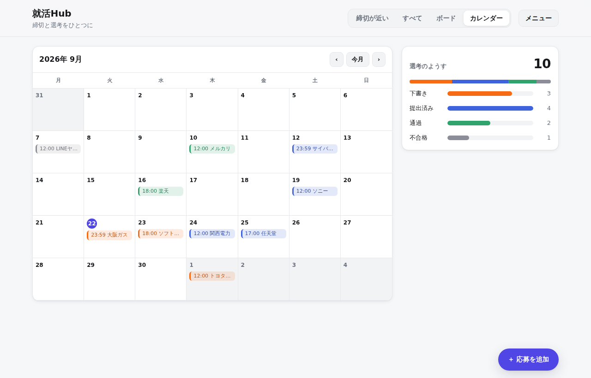
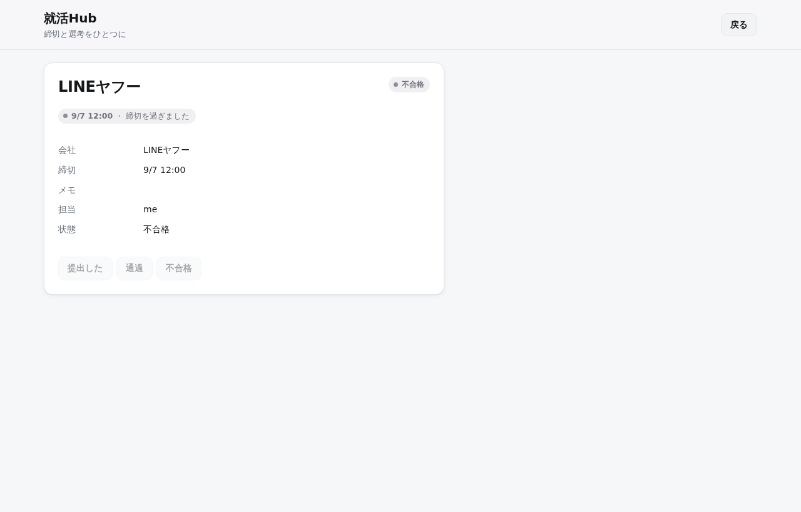
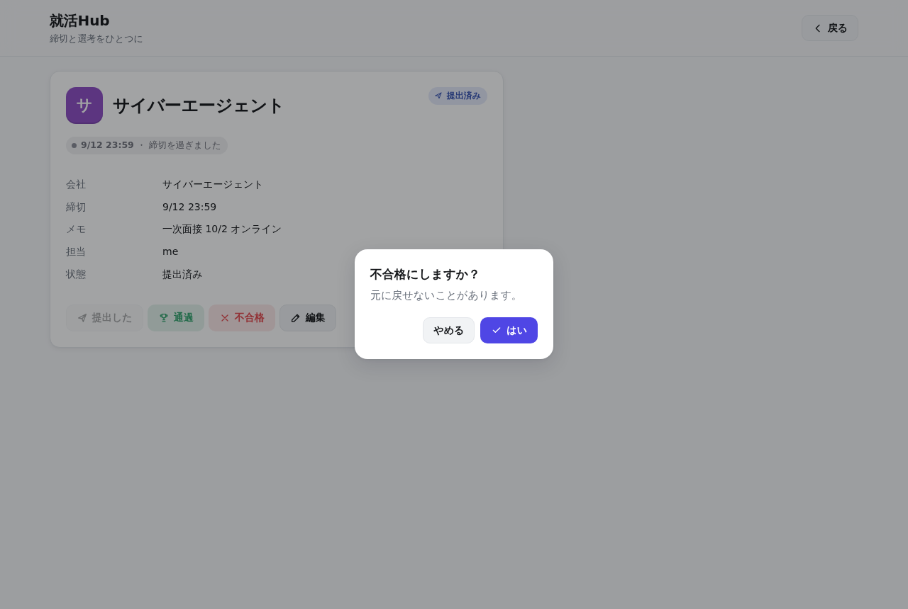
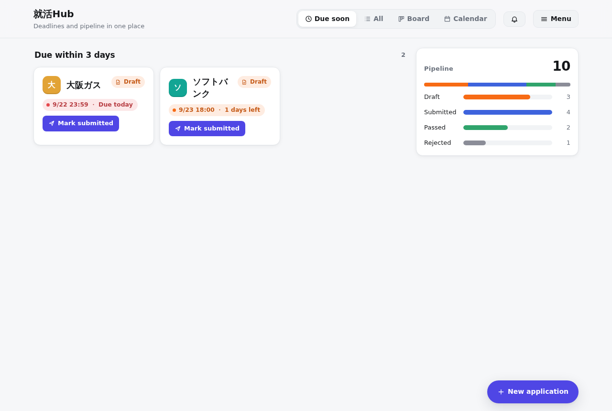

# nameless-lang（仮）— 人とAIの間の言語

**人は決めて、AIが書いて、言語が守る。**

人は「何が欲しいか・何がダメか・何がまだ決まってないか」だけを書く。
決まった部分は言語がそのまま動かし、AIは契約（例・禁止・逃げ道）の付いた小さな穴だけを埋める。
決めてないことがあれば、動かす前にエラーで止まる。依存は Python の標準機能だけ。

```
thing Application
  company   text
  deadline  monthday
  owner     User  gone[remove too]
  status[draft | submitted | passed | failed]

flow Application.status
  draft -> submitted -> passed | failed
  failed > passed

list DueSoon
  of     Application
  where  status is draft
  where  deadline within 3 days
  sort   deadline

rule Remind
  why   締切を落とさないため
  when  every day at 21:00
  do    notify owner each of DueSoon
```

## 使い方

```
python -m lang check spec/hub_app.lang     # 決めてないことを探す（エラー30種）
python -m lang test  spec/hub_app.lang     # example と never を全部流す
python -m lang fill  spec/hub_app.lang     # AIに action の中身を書かせる（要 ANTHROPIC_API_KEY）
python -m lang fmt   spec/hub_app.lang     # 見た目を整える
python -m lang run   spec/hub_app.lang     # 動かす → http://127.0.0.1:8000/
python -m lang build spec/hub_app.lang     # 1つのファイル（hub_app.pyz）にまとめる → python hub_app.pyz
python -m pytest                           # テスト
```

## 読むもの

| ファイル | 中身 |
|---|---|
| `docs/言語仕様_v0.2.md` | 仕様書（最新） |
| `REVIEW.md` | ダメだと思ったパーツ・欲しいもの・まだ動かないもの（判断待ち） |
| `docs/DECISIONS.md` | 仮で決めたことの一覧（承認待ち、おすすめ付き） |
| `EXPERIMENT.md` | 自然文で頼む vs この言語で頼む、の比較実験 |
| `REPORT.md` | これまでの作業の記録 |
| `docs/design/` | 相談のメモ、名前の候補、細かい疑問 |

## 中身

| 場所 | 中身 |
|---|---|
| `lang/parser.py` | 見出し／節の木にする |
| `lang/checker.py` | 決めてないことを探す（1つ1関数） |
| `lang/runtime.py` | 実行エンジン（箱ごとに1つずつ、箱をまたぐと並列） |
| `lang/body.py` | action の中身（do と shape）を動かす |
| `lang/fill.py` | AIに中身を書かせて、機械で確かめて、ダメなら書き直させる |
| `lang/server.py`、`lang/page.html` | 画面（素の HTML / CSS / JavaScript） |
| `lang/fmt.py` | 整形 |
| `spec/hub_app.lang` | 就活Hub。ブラウザで動く |
| `spec/hub_app.lang.ai/` | AIが書いた action の中身 |
| `experiment/v2/` | 比較実験（プロンプト・AIの返事・採点） |
| `lang/build.py` | 1つのファイルにまとめる |
| `editor/vscode/` | エディタの色分け |
| `archive/v01/` | v0.1 の時のもの（当時のまま） |

## 動いている画面

| 締切が近い | すべて（検索・まとまり） | ボード |
|---|---|---|
|  |  |  |

| カレンダー | 詳しく | 確認 | 英語 |
|---|---|---|---|
|  |  |  |  |
