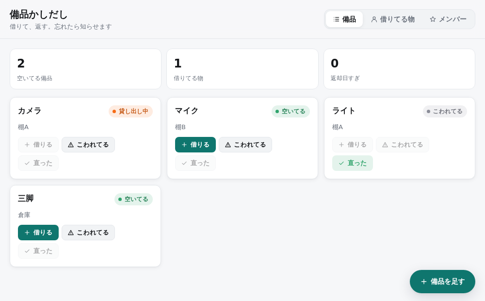
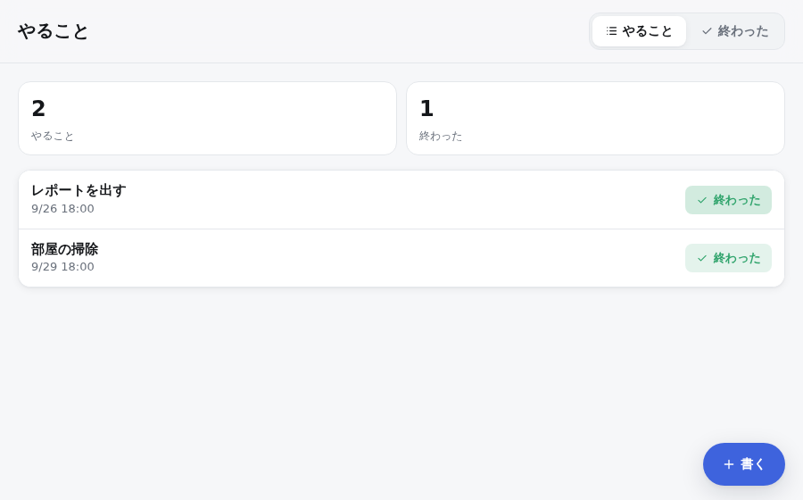
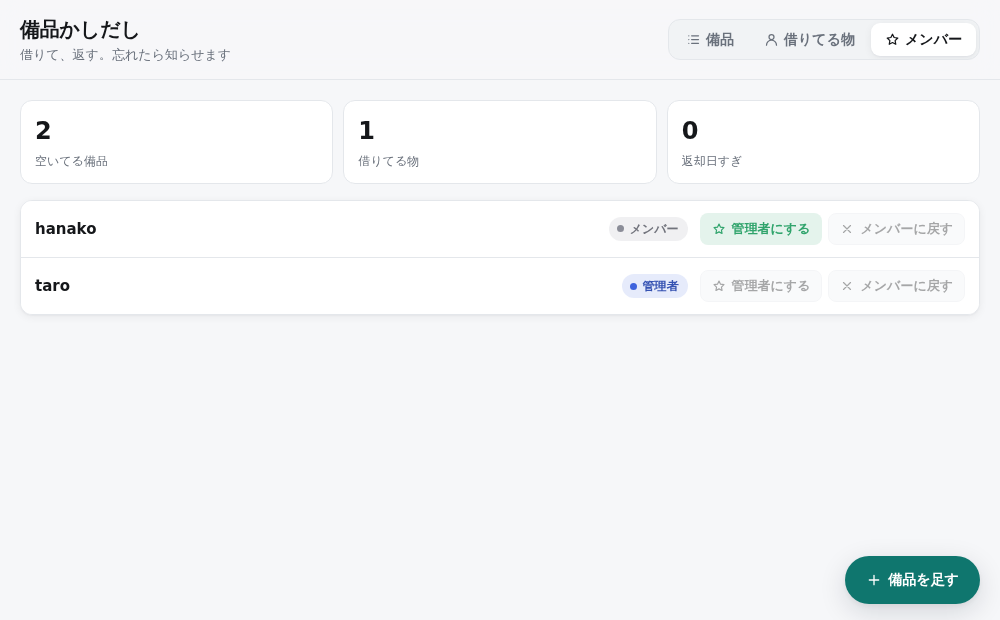
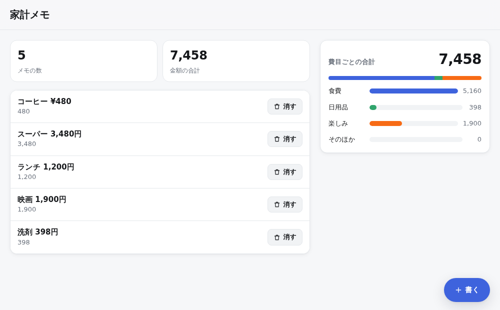
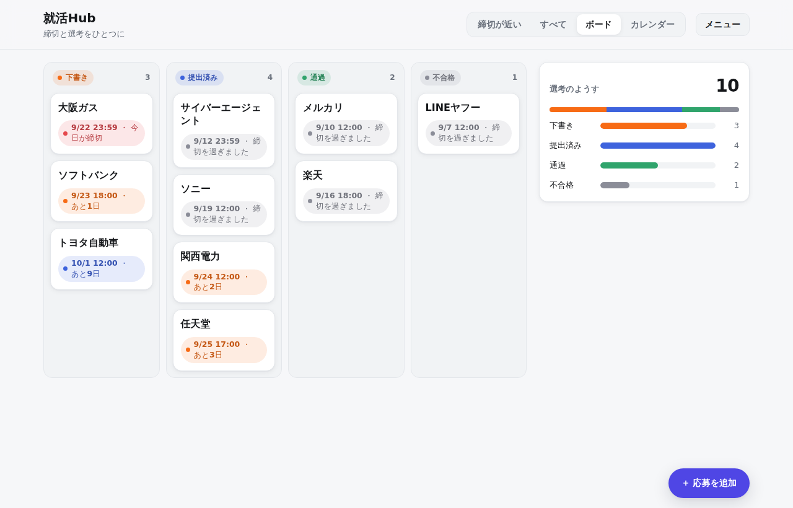

# Ponte（ポンテ）

> Ponte はイタリア語で「橋」。人とAIの間にかかる橋、そして上の決まりと裏の Python をつなぐ橋。

**人は決めて、AIが書いて、言語が守る。**

AIにアプリを作ってもらうとき、いちばん困るのは「決めてないことを、AIが勝手に決めてしまう」こと。
この言語では、人は **何が欲しいか・何がダメか・何がまだ決まってないか** だけを書く。

- 決まったこと（データの形・状態の流れ・誰が何をできるか・画面）は、言語がそのまま動かす。
- AIが書くのは、契約（例・禁止・逃げ道）の付いた小さな穴だけ。
- 決めてないことがあれば、**動かす前にエラーで止まる。**

依存は Python 3.11 の標準機能だけ（ライブラリも Go も要らない）。



---

## 30秒で

```
thing Item
  name    text
  status[free | lent | broken]

rule Borrow
  why   空いている備品を借りる
  when  user taps borrow-button on Item
  where status is free
  do    create Loan
          item  this
          due   7 days from now
  example
    given Item
      name    "カメラ"
      status  free
    taps borrow-button on Item
      name "カメラ"
    expect Item is lent
      name "カメラ"
```

打ち間違いも、決め忘れも、動かす前に止まる。

```
$ python -m ponte check todo.ponte
渡せません（1件）
  todo.ponte:20  E32  rule Finish: Task に「finished」という状態はありません（todo / done）
```

example で確かめていない所も教えてくれる。

```
$ python -m ponte test todo.ponte
穴（example で確かめていない所 3件）
  rule Finish: when があるのに example がありません
  flow Task.status: todo -> done をどの example も通っていません
```

## 比べてみた

同じアプリを「日本語で頼む」のと「この言語で頼む」ので、AIに16回ずつ書かせて、同じ14個の隠しテストを当てた（[EXPERIMENT.md](EXPERIMENT.md)）。

| | 日本語で頼む | この言語で頼む |
|---|---|---|
| 全部通った（Sonnet・2回目の条件） | 3/5 | 5/5 |
| 全部通った（Haiku） | 1/6 | 6/6 |
| AIが推測で埋めた所 | 1回あたり約6個 | 0 |
| AIが書いた行数 | 約170行 | 約20行 |

この言語の方は、1回目で間違えても言語がエラーを返すので、AIが直せる（ループ後の数字）。
弱い所も [EXPERIMENT.md](EXPERIMENT.md) に正直に書いてある。

---

## はじめる

```
git clone https://github.com/AnIT012/nameless-lang
cd nameless-lang
python -m ponte run spec/todo.ponte        # → http://127.0.0.1:8000/

pip install -e .                           # 入れると `ponte run spec/todo.ponte` だけで動く（依存は増えない）
```

1歩ずつ作るなら **[docs/入門.md](docs/入門.md)**（やることアプリを、エラーを見ながら作る）。

## コマンド

| コマンド | すること |
|---|---|
| `python -m ponte new myapp` | ひな形から新しいアプリを作る（最初から check も test も通る） |
| `python -m ponte check 仕様.ponte` | 決めてないこと・間違いを探す（エラー32種） |
| `python -m ponte test 仕様.ponte` | example と never を全部流す。確かめていない所（穴）も出す。`--strict` で穴も失敗に |
| `python -m ponte run 仕様.ponte` | 動かす（ブラウザの画面つき） |
| `python -m ponte fill 仕様.ponte` | AIに action の中身を書かせて、機械で確かめる（要 `ANTHROPIC_API_KEY`） |
| `python -m ponte guide` | AIに渡す書き方の説明を出す（実装から作るので、実装とずれない）。`--rules` で rule の書き方 |
| `python -m ponte fmt 仕様.ponte` | 見た目を整える（意味が変わるなら書かない） |
| `python -m ponte build 仕様.ponte` | 1つのファイル（.pyz）にまとめる → `python app.pyz` |
| `python -m ponte role 仕様.ponte 名前 admin` | 最初の管理者を決める |
| `python -m pytest` | 言語そのもののテスト |

## 見本のアプリ

| アプリ | 見どころ | |
|---|---|---|
| [spec/todo.ponte](spec/todo.ponte) やること | 入門のできあがり。一番小さい |  |
| [spec/lend.ponte](spec/lend.ponte) 備品かしだし | 役割（管理者）、2つの thing のつながり、rule の where、件数 |  |
| [spec/kakeibo.ponte](spec/kakeibo.ponte) 家計メモ | 標準ライブラリ（`use std/money`）で金額を拾って合計 |  |
| [spec/hub_app.ponte](spec/hub_app.ponte) 就活Hub | メールから締切を拾う（AIが中身を書いた action）、ボード・カレンダー・英語 |  |

## 言語の中身（ひとめで）

| パーツ | 書くこと |
|---|---|
| `thing` | データの形。`status[draft \| submitted]` のような状態も |
| `flow` | 状態の流れ（`draft -> submitted`）と、ぶつかった時の勝ち（`failed > passed`） |
| `who` | 誰が何をできるか。書いてないことは誰もできない |
| `list` | 条件で絞った一覧 |
| `rule` | きっかけ → やること（1つだけ）。`example` で確かめる |
| `relate` | rule 同士の関係（`then` / `then no` / `before` / `>` / `else`） |
| `action` | AIが中身を書く穴。`example`・`never`・`else` の契約付き |
| `scene` / `look` / `part` / `input` / `style` / `words` | 画面・見せ方・部品・入力・見た目・言葉（日本語と英語） |
| `use std/...` | 標準ライブラリ（日付・金額・メール・電話） |
| `tbd` / `##` | まだ決めてないこと。残っていると動かない |

全部は **[仕様書 v0.3](docs/言語仕様_v0.3.md)**。

## リポジトリの中

| 場所 | 中身 |
|---|---|
| `ponte/` | 言語の本体（パーサ・チェッカー・実行エンジン・画面・AIの穴埋め）→ [docs/仕組み.md](docs/仕組み.md) |
| `ponte/std/` | 標準ライブラリ（中身もこの言語） |
| `spec/` | 見本のアプリ |
| `tests/` | テスト（270件ほど） |
| `docs/` | 仕様書・入門・仕組み・決めごと・画面の写真 |
| `site/` | ホームページ（`python site/build.py` で作る。main に入ると GitHub Pages へ） |
| `experiment/` | 比較実験（プロンプト・AIの返事・採点） |
| `editor/vscode/` | エディタの色分け |
| `archive/v01/` | 最初の版（当時のまま） |

記録: [CHANGELOG.md](CHANGELOG.md)（何が入ったか）/ [REPORT.md](REPORT.md)（作業の記録）/ [REVIEW.md](REVIEW.md)（ダメなパーツと欲しいもの）/ [docs/DECISIONS.md](docs/DECISIONS.md)（決めごと）

手を入れるなら: [CONTRIBUTING.md](CONTRIBUTING.md)

## いまの限界

- **ログインが仮。** 今は URL の `?user=名前` で誰にでもなれる。人に使ってもらう前に、本当のログインが要る。
- **例と never に書いてないことは守れない。** 穴さがしで「書いていない所」は見えるが、書くのは人。
- **道具はまだ少ない。** 曜日・日付の足し算・json などは「まだ無い道具」（書くとエラー）。
